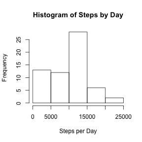
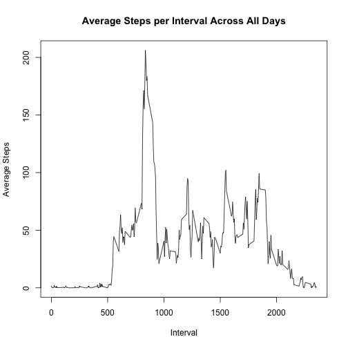
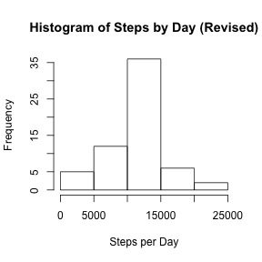
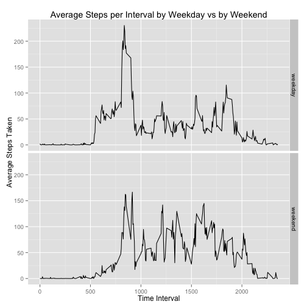

## Loading and preprocessing the data
1. Download the file from the internet using the web address given in the
instructions:

```r
fn = "https://d396qusza40orc.cloudfront.net/repdata%2Fdata%2Factivity.zip" 
download.file(url=fn, destfile="activity.zip", method="curl")
```

2. Extract the data from the zip file.

```r
unzip("activity.zip")
```

3. Read in the dataset.  The date field imports as character, we replace that
   field to be of class Date.

```r
library(dplyr)
data <- tbl_df(read.csv("activity.csv", sep=","))
data$date <- as.Date(data$date, format="%Y-%m-%d")
```
4. Add a 'weekday' field to assist in imputing values later and performing a 
  'day of week' analysis later in the study.

```r
data$weekday <- weekdays(data$date)
```

Now here is a glimpse of the dataset:

```r
data
```

```
## Source: local data frame [17,568 x 4]
## 
##    steps       date interval weekday
## 1     NA 2012-10-01        0  Monday
## 2     NA 2012-10-01        5  Monday
## 3     NA 2012-10-01       10  Monday
## 4     NA 2012-10-01       15  Monday
## 5     NA 2012-10-01       20  Monday
## 6     NA 2012-10-01       25  Monday
## 7     NA 2012-10-01       30  Monday
## 8     NA 2012-10-01       35  Monday
## 9     NA 2012-10-01       40  Monday
## 10    NA 2012-10-01       45  Monday
## ..   ...        ...      ...     ...
```

5. Some data exploration.  
Histogram of total number of steps taken each day.  First we create the
variable to hold the total steps by day:

```r
steps_by_day <- data %>% 
    group_by(date) %>%
    summarize(total_steps = sum(steps, na.rm=TRUE))

steps_by_day
```

```
## Source: local data frame [61 x 2]
## 
##          date total_steps
## 1  2012-10-01           0
## 2  2012-10-02         126
## 3  2012-10-03       11352
## 4  2012-10-04       12116
## 5  2012-10-05       13294
## 6  2012-10-06       15420
## 7  2012-10-07       11015
## 8  2012-10-08           0
## 9  2012-10-09       12811
## 10 2012-10-10        9900
## ..        ...         ...
```

Now let's draw the histogram:

```r
hist(steps_by_day$total_steps, main="Histogram of Steps by Day",
     xlab="Steps per Day", ylab="Frequency")
```

 

## What is mean total number of steps taken per day?
We'll look at both the mean and the median of total steps per day:

```r
mean(steps_by_day$total_steps, na.rm=TRUE)
```

```
## [1] 9354.23
```

```r
median(steps_by_day$total_steps, na.rm=TRUE)
```

```
## [1] 10395
```

## What is the average daily activity pattern?
To analyze the average daily activity pattern first we must group the steps taken by the time interval:

```r
avg_steps_by_interval <- data %>%
    group_by(interval) %>%
    summarize(avg_steps = mean(steps, na.rm=TRUE))

avg_steps_by_interval
```

```
## Source: local data frame [288 x 2]
## 
##    interval avg_steps
## 1         0 1.7169811
## 2         5 0.3396226
## 3        10 0.1320755
## 4        15 0.1509434
## 5        20 0.0754717
## 6        25 2.0943396
## 7        30 0.5283019
## 8        35 0.8679245
## 9        40 0.0000000
## 10       45 1.4716981
## ..      ...       ...
```
Now we'll draw a time series plot of the data series:

```r
plot(avg_steps_by_interval$interval, avg_steps_by_interval$avg_steps, type="l",
     main="Average Steps per Interval Across All Days", 
     xlab="Interval", ylab="Average Steps")
```

 

Which 5-minute interval contains the maximum number of steps?

```r
avg_steps_by_interval %>%
    filter(avg_steps == max(avg_steps_by_interval$avg_steps))
```

```
## Source: local data frame [1 x 2]
## 
##   interval avg_steps
## 1      835    206.17
```

So interval 835 contains the maximum number of steps.

## Imputing missing values
First let's look at how many missing values (NAs) there are in the dataset:

```r
sum(is.na(data$steps))
```

```
## [1] 2304
```

To fill in these missing values we will use the mean for that five minute
interval for all days from the non-NA dataset.  We will use the variable
'avg_steps_by_interval' created above.

First let's build a short function that retrieves the interval average:

```r
retrieve_interval_avg <- function(row) {
    avg_steps_by_interval[avg_steps_by_interval$interval == data[row, "interval"]][["avg_steps"]]
}
```

Now we create a new variable from the original data and repopulate the 'steps'
field with imputed values using the function above:

```r
revised_data <- data
revised_data$steps[which(is.na(revised_data$steps))] <- retrieve_interval_avg(which(is.na(revised_data$steps))) 
```

Now let's re-inspect this new dataset:

```r
head(as.data.frame(revised_data))
```

```
##       steps       date interval weekday
## 1 1.7169811 2012-10-01        0  Monday
## 2 0.3396226 2012-10-01        5  Monday
## 3 0.1320755 2012-10-01       10  Monday
## 4 0.1509434 2012-10-01       15  Monday
## 5 0.0754717 2012-10-01       20  Monday
## 6 2.0943396 2012-10-01       25  Monday
```

So the data in the first day, which were initially NAs, have been replaced with
their associated interval average steps.

Let's re-create the total steps per day with the data:

```r
revised_steps_by_day <- revised_data %>% 
    group_by(date) %>%
    summarize(total_steps = sum(steps, na.rm=TRUE))

revised_steps_by_day
```

```
## Source: local data frame [61 x 2]
## 
##          date total_steps
## 1  2012-10-01     10766.2
## 2  2012-10-02       126.0
## 3  2012-10-03     11352.0
## 4  2012-10-04     12116.0
## 5  2012-10-05     13294.0
## 6  2012-10-06     15420.0
## 7  2012-10-07     11015.0
## 8  2012-10-08     10766.2
## 9  2012-10-09     12811.0
## 10 2012-10-10      9900.0
## ..        ...         ...
```

Now we'll redraw the histogram with the revised data:

```r
hist(revised_steps_by_day$total_steps, main="Histogram of Steps by Day (Revised)",
     xlab="Steps per Day", ylab="Frequency")
```

 

Finally we'll look at the mean and median of the data with the imputed values:

```r
mean(revised_steps_by_day$total_steps)
```

```
## [1] 10766.2
```

```r
median(revised_steps_by_day$total_steps)
```

```
## [1] 10766.2
```

Both the mean and the median are higher than the original dataset, by 15% and
3.5%, respectively.

## Are there differences in activity patterns between weekdays and weekends
First we'll use add a 'weekday/weekend' variable called 'daytype'.  First let's add a
function that will be used in mutate.

```r
get_daytype <- function(d) {
    d[which(d %in% c("Saturday", "Sunday"))] <- "weekend"
    d[which(!d == "weekend")] <- "weekday"
    d
}
```

Now we'll use that function to create the 'daytype' variable, and then convert
that field into a factor:

```r
revised_data <- revised_data %>%
    mutate(daytype = get_daytype(weekday))
revised_data$daytype = as.factor(revised_data$daytype)
```

We'll look at the data again to see it's shape and make sure we have what we
expect:

```r
revised_data
```

```
## Source: local data frame [17,568 x 5]
## 
##        steps       date interval weekday daytype
## 1  1.7169811 2012-10-01        0  Monday weekday
## 2  0.3396226 2012-10-01        5  Monday weekday
## 3  0.1320755 2012-10-01       10  Monday weekday
## 4  0.1509434 2012-10-01       15  Monday weekday
## 5  0.0754717 2012-10-01       20  Monday weekday
## 6  2.0943396 2012-10-01       25  Monday weekday
## 7  0.5283019 2012-10-01       30  Monday weekday
## 8  0.8679245 2012-10-01       35  Monday weekday
## 9  0.0000000 2012-10-01       40  Monday weekday
## 10 1.4716981 2012-10-01       45  Monday weekday
## ..       ...        ...      ...     ...     ...
```

Now we'll group interval data by weekday vs weekend and review charts
displaying time intervals of both.  
(NOTE: we use the variable 'revised_data' which has the NAs imputed)

```r
steps_by_daytype_by_interval <- revised_data %>%
    group_by(daytype, interval) %>%
    summarise(avg_steps = mean(steps))

steps_by_daytype_by_interval
```

```
## Source: local data frame [576 x 3]
## Groups: daytype
## 
##    daytype interval avg_steps
## 1  weekday        0 2.2511530
## 2  weekday        5 0.4452830
## 3  weekday       10 0.1731656
## 4  weekday       15 0.1979036
## 5  weekday       20 0.0989518
## 6  weekday       25 1.5903564
## 7  weekday       30 0.6926625
## 8  weekday       35 1.1379455
## 9  weekday       40 0.0000000
## 10 weekday       45 1.7962264
## ..     ...      ...       ...
```

Now we'll create a panel plot to plot the time intervals of weekdays vs
weekends to view differences in the two:  
(NOTE: We will make use of the ggplot2 library)

```r
library(ggplot2)
p <- ggplot(steps_by_daytype_by_interval, aes(interval, avg_steps)) + 
    geom_line() + ggtitle("Average Steps per Interval by Weekday vs by Weekend") +
    xlab("Time Interval") + ylab("Average Steps Taken")
p + facet_grid(daytype ~ .)
```

 

From looking at the two plots, weekdays appear to have an earlier and more
rapid rise in the earlier intervals, while weekends appear to maintain
higher levels across the middle and later parts of the day. This makes sense
in perspective of the labor vs. leisure periods typical of those day types.
